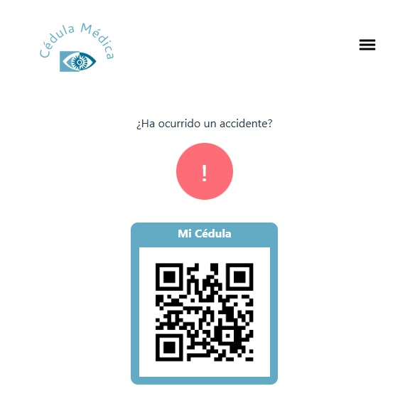
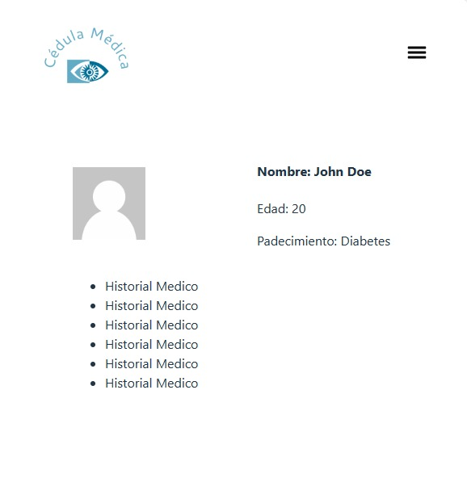
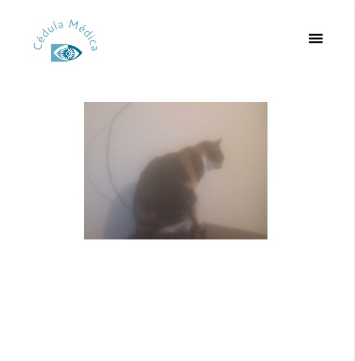

# Disclaimer

Por temas de diferencias en el equipo, Cedula Medica y Cedula Medica 2 se divieron, se hizo el proyecto desde 0

Además, mi compañera por temas de tiempo y salud, no puedo aparecer

# Cedula Medica FrontEnd

Este proyecto es una aplicación web diseñada para brindar asistencia rápida en caso de accidentes de tráfico. Utilizando tecnología de escaneo de códigos QR, la aplicación permite a los usuarios acceder fácilmente a información vital y comunicarse con los servicios de emergencia cuando más lo necesitan.

- DockerHub: [https://hub.docker.com/repository/docker/yorksgomez/cedula/general](https://hub.docker.com/repository/docker/yorksgomez/cedula-front/general)
- URL de la app: http://35.223.110.190/login

## Carecteristicas Importantes

### Seguridad

- JWT Token
- NO-CORS para testing

### Implementación

- Dockerizado
- 
- Se publica por el puerto 80
- Conexión a la api en el mismo servidor por puerto 8080
- Montado en un servidor en Google Cloud Platform para contenedores
- 
- React Router

### Rutas

- /login
- /register
- /home
- /user
- /history/:username/:salt

## Ejecución

Para ejecutarlo debe ejecutarse el comando en Windows

npm install

npm run dev

Puede ser que por configuración de la dockerización no se muestren algunos elementos, en este caso se recomienda hacer build del docker

## Vistas
### 1. Home

La página principal de la aplicación. Debería mostrar dos secciones:

Sección de Accidentes: Esta sección debería tener un mensaje que pregunta si ha ocurrido un accidente y un botón de llamada a la acción con un ícono de exclamación (!). Cuando se hace clic en este botón, debería dirigir al usuario a la página de escaneo (Scan).

Sección de Cédula de Identidad (ID): Aquí debería haber un cuadro que muestra el título "Mi Cédula" y un código QR. Este código QR puede representar la identificación del usuario.
Una página donde los usuarios pueden escanear un código QR. Debería tener una sección central que muestra la salida de la cámara web del dispositivo. Esta sección debería ser lo suficientemente grande como para mostrar la vista de la cámara. Una vez que se haya completado el escaneo (por ejemplo, después de un retraso simulado de 10 segundos), la página debería redirigir al usuario a la página de usuario (User).

### 2. User

Una página que muestra información sobre el usuario. Podría ser información personal, datos de contacto, historial de accidentes, etc. Esta página debería contener la información relevante y puede tener un diseño similar al de la página de inicio.

### 3. Me

Una página similar a la de usuario, pero centrada en la información personal del usuario que está actualmente autenticado en la aplicación. Podría mostrar detalles como nombre, dirección, número de teléfono, etc.

### 4. Login

Página para iniciar sesión.

### 5. Register
Página para crear la cuenta

